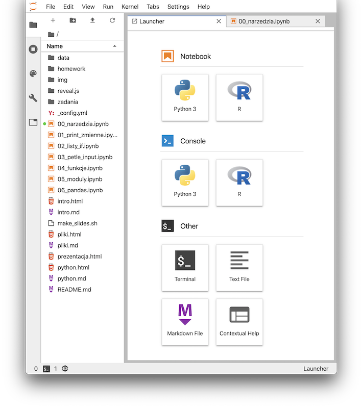
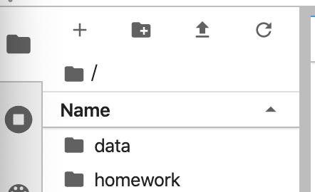
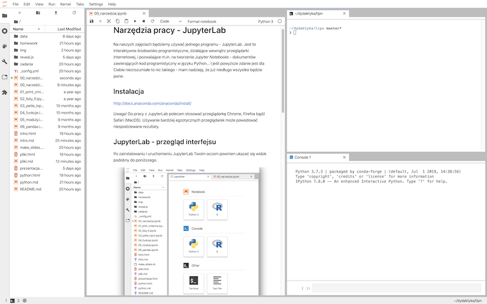

# Narzędzia pracy - JupyterLab

Na naszych zajęciach będziemy używać jednego programu - JupyterLab. Jest to interaktywne środowisko programistyczne, działające wewnątrz przeglądarki internetowej, i pozwalające m.in. na tworzenie _Jupyter Notebooks_ - dokumentów zawierających kod programistyczny w języku Python... I jeśli powyższe zdanie jest dla Ciebie niezrozumiałe to nic takiego - mam nadzieję, że już niedługo wszystko będzie jasne.

## Instalacja

<http://docs.anaconda.com/anaconda/install/>

Uwaga! Do pracy z JupyterLab polecam stosować przeglądarkę Chrome, Firefox bądź Safari (MacOS). Używanie bardziej egzotycznych przeglądarek może powodować niespodziewane rezultaty.

## JupyterLab - przegląd interfejsu

Po zainstalowaniu i uruchomieniu JupyterLab Twoim oczom powinien ukazać się widok podobny do poniższego.

W górnej części okna widzimy klasyczne menu, ze znanymi z innych programów pozycjami `File`, `Edit` czy `Help`. Z lewej widzimy boczny panel, który zawiera bardzo ważny element - **przeglądarkę plików** (file browser). Służy ona do przeglądania, otwierania, kopiowania, zmieniania nazw plików. Powyżej okna przeglądarki znajdują się przyciski, które będą przydatne. Są to w kolejności:

- _New Launcher_: otwiera kartę _launcher_, służącą do tworzenia nowych kart
- _New folder_: tworzy nowy folder
- _Upload files_: pozwala dodawać do bierzącego folderu nowe pliki przy użyciu interfejsu przeglądarki
- _Refresh file list_: odświeża listę plików w przeglądarce (przydatne, gdy np. nasz program tworzy nowe pliki)

Poniżej tych przycisków widzimy **ścieżkę dostępu** do aktualnie wybranego folderu.

Pamiętaj, że przytrzymanie kursora kilka sekund nad jakimś elementem interfejsu spowoduje wyświetlenie podpowiedzi.

### Launcher i karty

Launcher jest kartą, która służy do tworzenia nowych kart. Możemy za jego pomocą utworzyć nowy _notebook_ (o czym zaraz). Możemy też utworzyć nową konsolę (_Console - Python 3_), okno terminala (_Terminal_) bądź plik tekstowy (_Text file_). Kliknięcie na dowolny przycisk w launcherze powoduje utworzenie nowej karty z daną zawartością. Karty można dowolnie przesuwać i ustawiać wewnątrz interfejsu, poprzez przeciąganie ich tytułów w rożne miejsca. Poniższy przykład pokazuje jedno z możliwych ustawień interfejsu.

