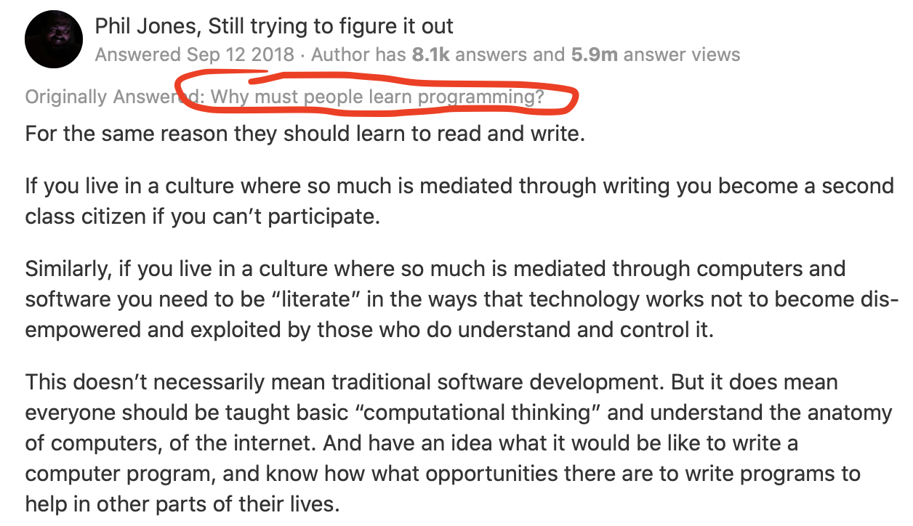
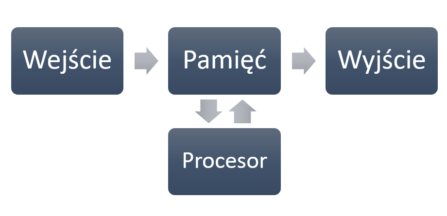
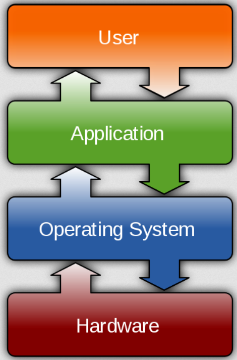
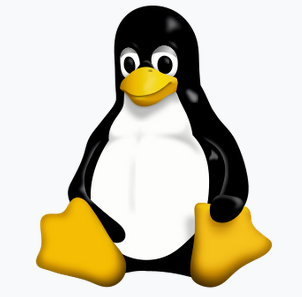

### O mnie

- k.basinski@gumed.edu.pl
- Krzysztof Basiński
- Zakład Badań nad Jakością Życia
- Tuwima 15, pok. 312

### O tym przedmiocie

- 10 spotkań po 3 godziny = 30 godzin
- Zaliczenie z oceną
- Można mieć 1 nieobecność

### Ocena

- Na każdych zajęciach robimy zadania
- Kto nie zdąży, robi w domu
- Każde zadanie ma 1 i 2 termin
- Za poprawne rozwiązanie w 1 terminie 5 pkt.
- Za poprawne rozwiązanie w 2 terminie 3 pkt.

### Czego się nauczymy?

- Myślenia programistycznego, niezależnie od języka
- Myślenia wykorzystującego teorię informacji
- Korzystania z nowoczesnych technologii, dobrodziejstw otwartego oprogramowania i internetu
- Tworzenia ładnych i **reprodukowalnych** dokumentów

### Czego dokładnie się nauczymy?

- Podstaw programowania w języku `Python`
- Podstaw programowania interaktywnego (JupyterLab)

### Po co ci programowanie?

- Bo będziesz mądrzejszy
- Bo automatyzowanie czynności jest super
- Bo rozpoznasz, które problemy wymagają podejścia programistycznego
- Bo (po jakimś czasie) będziesz pracować szybciej

---

### Jak działają komputery?

### Komputer == kalkulator

### Wejście i wyjście

### Dane wejściowe

- Klawiatura
- Myszka
- Touchpad?
- Plik na dysku
- Dane zdalne, uzyskane przez sieć
- etc.

### Pamięć

- RAM - Random Access Memory
- Pamięć "chwilowa" - informacje zapisywane na moment, po to by CPU wykonał operacje

### Procesor (CPU)

- Bardzo szybki kalkulator
- Jak szybki?
- Ok. 50 miliardów operacji na sekundę w nowoczesnym laptopie

### Dane wyjściowe

- Ekran
- Plik
- Słuchawki bluetooth
- Adresat e-maila
- etc.

### Bit

- Podstawowa jednostka informacji
- Przyjmuje wartości **0 lub 1**
- Ciąg ośmiu bitów daje jeden **bajt** - najprostszy sposób zapisania np. pojedynczego znaku

### ASCII

- Siedem bitów
- Np. `011 1001` - cyfra *9*
- Np. `100 0001` - litera *A*
- Np. `010 0000` - spacja
- Jeden z możliwych standardów kodowania znaków

### UTF-8

- Złoty standard kodowania znaków
- 1,112,064 możliwych znaków
- od 8 do 32 bitów
- Dobra rada - jeśli możesz, **zawsze używaj kodowania UTF-8**
- Programy firmy Microsoft uporczywie *nie używają* kodowania UTF-8

### Bajty

- Osiem bitów daje jeden bajt
- Dokładając przedrostek (z układu SI), dostajemy znane jednostki
    + **KILO**bajty (1,000 bajtów)
    + **MEGA**bajty (1,000,000 bajtów)
    + **GIGA**bajty (1,000,000,000 bajtów)
    + **TERA**bajty (1,000,000,000,000 bajtów)

### Programy

- Skąd procesor wie, jakiego rodzaju operacje ma wykonać na danych?
- Mówi mu to ciąg instrukcji zwany **programem**
- Program komputerowy działa tak samo jak programator w pralce
- Aby CPU zrozumiał program, musi on być napisany w **kodzie maszynowym**

### Kod maszynowy

    8B542408 83FA0077 06B80000 0000C383
    FA027706 B8010000 00C353BB 01000000
    B9010000 008D0419 83FA0376 078BD989
    C14AEBF1 5BC3

### Assembler

    fib:
    mov edx, [esp+8]
    cmp edx, 0
    ja @f
    mov eax, 0
    ret

    @@:
    cmp edx, 2
    ja @f
    mov eax, 1
    ret

    @@:
    push ebx
    mov ebx, 1
    mov ecx, 1

    @@:
        lea eax, [ebx+ecx]
        cmp edx, 3
        jbe @f
        mov ebx, ecx
        mov ecx, eax
        dec edx
    jmp @b

    @@:
    pop ebx
    ret

### C

    unsigned int fib(unsigned int n) {
    if (n <= 0)
        return 0;
    else if (n <= 2)
        return 1;
    else {
        unsigned int a,b,c;
        a = 1;
        b = 1;
        while (1) {
            c = a + b;
            if (n <= 3) return c;
            a = b;
            b = c;
            n--;
        }
      }
    }

### Języki programowania wysokiego/wyższego poziomu

- **Python**
- Java
- Ruby
- Pearl
- R

### System operacyjny (OS)

- *Program do uruchamiania programów*
- Komunikuje się z *hardwarem*
- Zapewnia podstawowe funkcjonalności:
    + I/O
    + Sieć
    + Dostęp do danych na dysku
- Programy piszę się pod konkretny OS

### Systemy operacyjne

### Systemy operacyjne - Windows

### Systemy operacyjne - MacOS

### Systemy operacyjne - Linux

